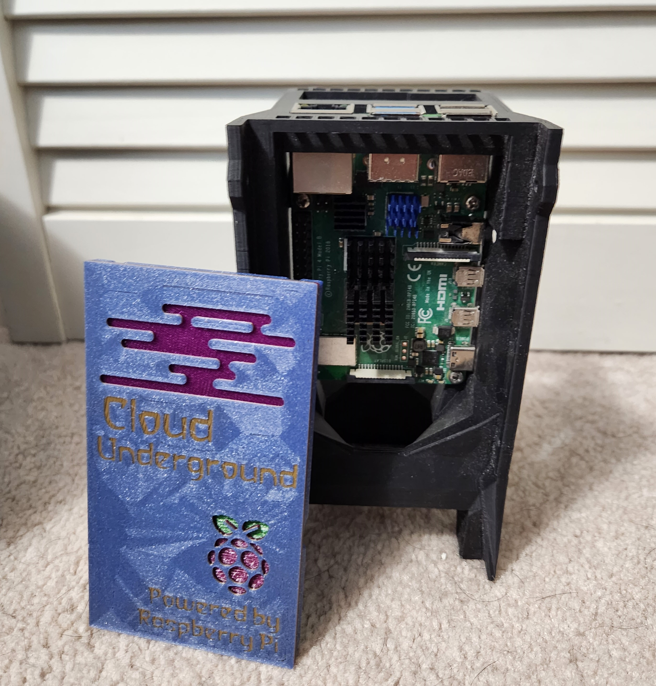

The dual pi case is a specialty case for Raspberry Pi's that allows you to house two Raspberry Pi's in a single case. It also has a spot for a 2.5" solid state hard drive (SSD) on the back and comes with a USB to SATA adapter so you can use a SSD. The two Raspberry Pi's are cooled by a single Noctua 40mm PWM fan. The cases are also stackable so you can save room on your desk, whether you have two Pis or twenty-two!
