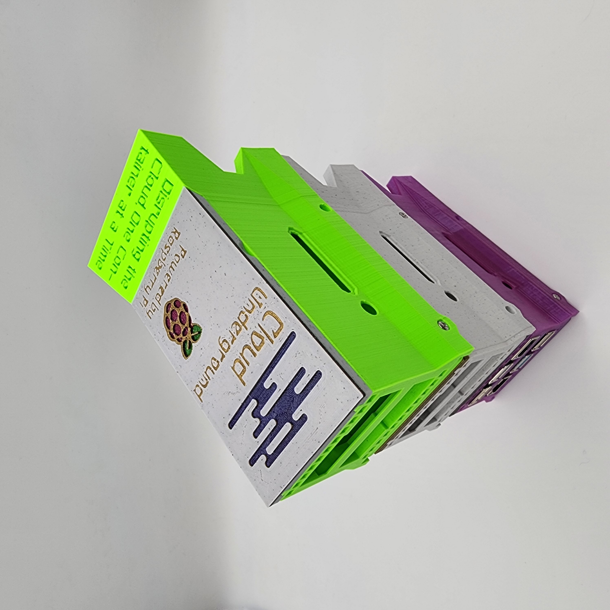

The dual Pi case is a specialty case for Raspberry Pi's that allows you to house two Raspberry Pi's in a single case. The cases are also stackable so you can save room on your desk, whether you have two Pis or twenty-two!

The dual Pi case also has a spot for a 2.5" solid state drive (SSD) and comes with a USB to SATA adapter .

The two Raspberry Pi's are cooled by a single Noctua 40mm PWM fan that runs off the GPIO header on one of the Raspberry Pis.

We include all of the accessories you need to run your Raspberry Pis. That includes the following:
- Case
- SATA to USB adapter
- 2x Power supplies (with on/off switch)
- Micro HDMI to regular HDMI cable
- Noctua 40mm 5v PWM fan
- 2x High endurance SD cards
- SD card reader
- Necessary screws
- Heatsinks for 2 Pis

You can also select the PoE option if you plan to power the Raspberry Pis with PoE. This option comes with 2 PoE hats and excludes the external power supplies.

