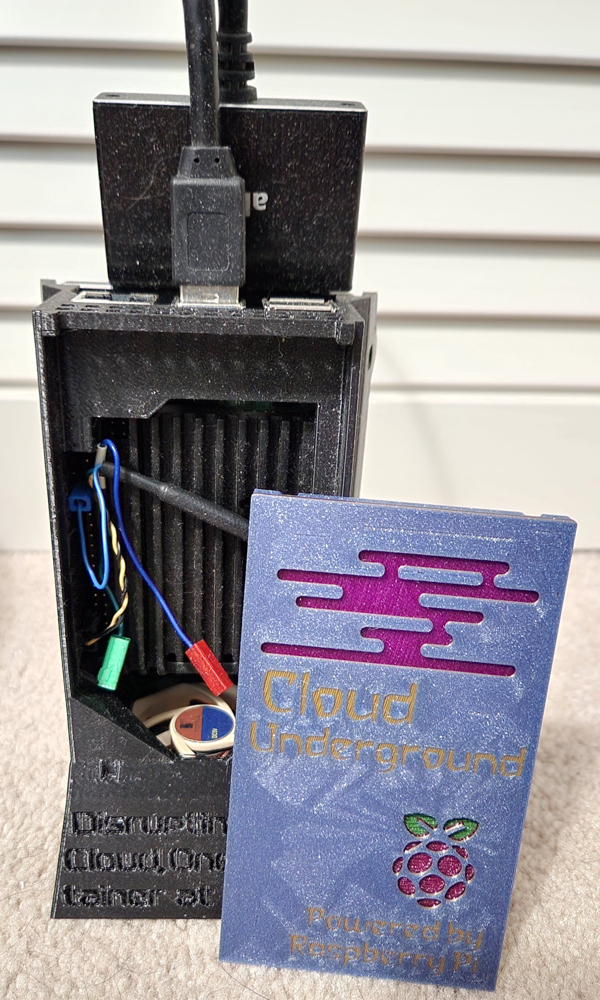

This is a case for housing a single Raspberry Pi 4b. While you may have seen many other Raspberry Pi Cases on the market this one is unique for being an upright case that utilizes a large aluminum heatsink to achieve superior cooling performance that will allow you to attain the highest overclocks that are achievable on a Raspberry Pi. The case can also stack on itself or on the Dual Pi case we sell to give you many options for you Pi cluster case needs.
