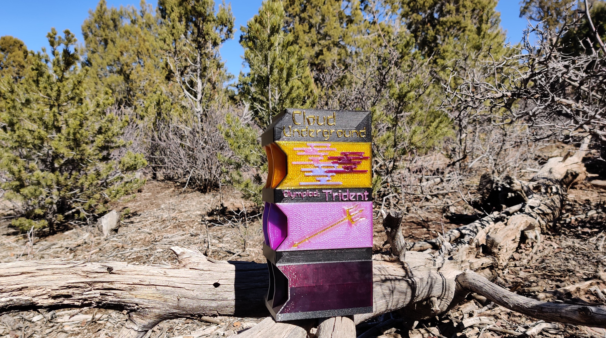

The Trident is a specialty case designed to hold two Raspberry Pi 4bs and a single Nvidia Jetson Nano Developer Kit. The three single board computers are cooled by a single 60mm Noctua fan and are designed to be powered by power over ethernet (PoE). The case is also designed to house two 2.5" solid state hard drives (SSDs). If you want a case to house a hybrid super computer this might be the case for you!
